## At a glance

<small style="display:block; margin-top:6px;">Diagram: checkout flow from your site to SuiOutKit and on-chain settlement.</small>

You call the SDK; SuiOutKit handles providers, sessions, and on-chain payout.

## Typical flow
### 1. Create session

You call `initCheckout` with amount, currency, and optional metadata. The SDK returns a session your UI can pass to the modal.

### 2. Customer pays
`openModal` (or `wrapButton`) lets the customer choose:

- **Bank transfer** - virtual account details in the modal  
- **OPay** - push to their phone  
- **Card** - Stripe in the modal  
- **Sui wallet / outPay** - crypto in the same UI  

### 3. Settlement
After the payment provider confirms, SuiOutKit completes settlement on Sui. The modal polls until the session is **SETTLED** (or shows an error).

You receive funds at the **merchant address** you configured. A receipt is recorded on-chain.

## Fiat vs crypto

| Path | Customer pays | You receive |
|------|----------------|-------------|
| Fiat | Bank, OPay, or card | Settlement on Sui after provider confirmation |
| Crypto | Wallet or outPay in the modal | On-chain payment verified by SuiOutKit |

You use the same SDK methods for both - the modal handles the difference.

## What you don’t build

- Payment provider integrations per rail  
- Session store or webhook servers  
- Settlement transactions or treasury management  

That is all part of the SuiOutKit service behind the SDK.

## Learn more

- [SDK Reference](/docs/guides/sdk) - methods and helpers  
- [Architecture](/docs/guides/architecture) - how the platform fits together  
- [Quick Start](/docs/getting-started/quick-start) - code in minutes  
